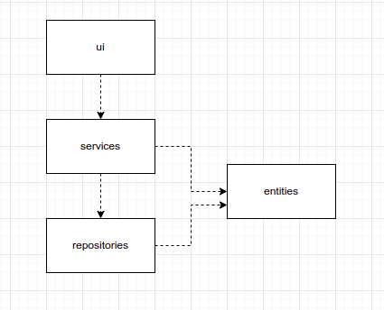
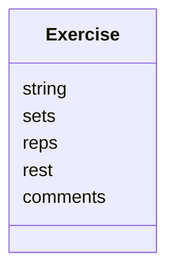
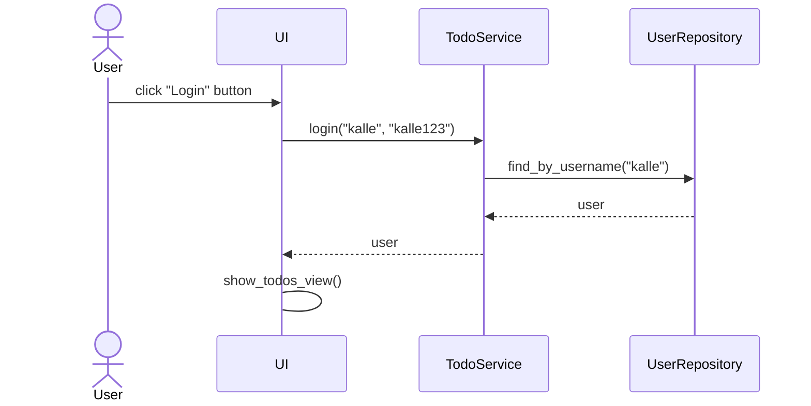
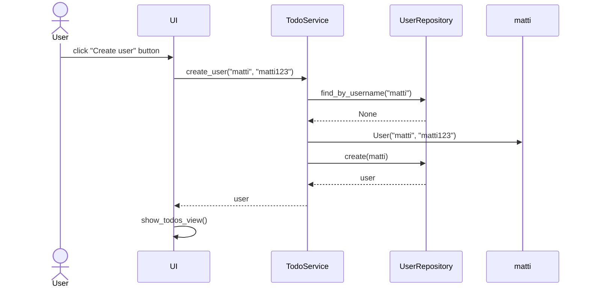
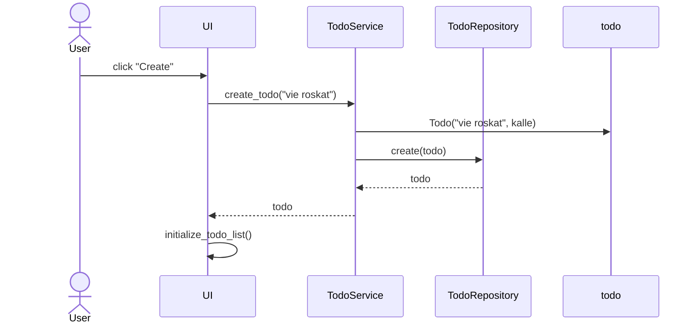

# Arkkitehtuurikuvaus

## Rakenne

Koodin pakkausrakenne on seuraava:



Pakkaus _ui_ sisältää käyttöliittymästä, _services_ sovelluslogiikasta ja _repositories_ tietojen pysyväistallennuksesta vastaavan koodin. Pakkaus _entities_ sisältää luokkia, jotka kuvastavat sovelluksen käyttämiä tietokohteita.

## Käyttöliittymä

Käyttöliittymä on toteutettu tekstikäyttöliittymänä, josta vastaavat luokat ui ja console.

Tekstikäyttöliittymän valikon näyttämisestä ja sen käyttämisestä vastaa [UI](https://github.com/JoJoensuu/ot-harjoitustyo/blob/master/python-strenght-training-app/src/ui/ui.py)-luokka. Käyttäjän syöttämän tekstin välittämisestä vastaa [Console](https://github.com/JoJoensuu/ot-harjoitustyo/blob/master/python-strenght-training-app/src/ui/console.py)-luokka. Käyttöliittymä on pyritetty eristämään täysin sovelluslogiikasta. Se kutsuu [Service](https://github.com/JoJoensuu/ot-harjoitustyo/blob/master/python-strenght-training-app/src/services/service.py)-luokan metodeja.

## Sovelluslogiikka

Sovelluksen loogisen tietomallin muodostaa luokka  [Exercise](https://github.com/JoJoensuu/ot-harjoitustyo/blob/master/python-strenght-training-app/src/entities/exercise.py), joka kuvaa yhtä harjoitusta.



Toiminnallisista kokonaisuuksista vastaa luokkan [Service](https://github.com/JoJoensuu/ot-harjoitustyo/blob/master/python-strenght-training-app/src/services/service.py) ainoa olio. Luokka tarjoaa kaikille käyttäliittymän toiminnoille oman metodin.

_Service_ pääsee käsiksi harjoituksiin tietojen tallennuksesta vastaavan pakkauksessa _repositories_ sijaitsevien luokkien [ExerciseRepository](https://github.com/JoJoensuu/ot-harjoitustyo/blob/master/python-strenght-training-app/src/repositories/exercise_repository.py) ja [ExerciseDayRepository](https://github.com/JoJoensuu/ot-harjoitustyo/blob/master/python-strenght-training-app/src/repositories/exercise_day_repository.py) kautta. Luokkien toteutuksen [injektoidaan](https://en.wikipedia.org/wiki/Dependency_injection) sovelluslogiikalle konstruktorikutsun yhteydessä.

`Service`-luokan ja ohjelman muiden osien suhdetta kuvaava luokka/pakkauskaavio:


## Tietojen pysyväistallennus

Pakkauksen _repositories_ luokat `ExerciseRepository` ja `ExerciseDayRepository` huolehtivat tietojen tallettamisesta. Molemmat tallentavat tietoa SQLite-tietokantaan.

Luokat noudattavat [Repository](https://en.wikipedia.org/wiki/Data_access_object) -suunnittelumallia ja ne on tarvittaessa mahdollista korvata uusilla toteutuksilla, jos sovelluksen datan talletustapaa päätetään vaihtaa.

### Tiedostot

Sovellus tallettaa käyttäjien ja todojen tiedot erillisiin tiedostoihin.

Sovelluksen juureen sijoitettu [konfiguraatiotiedosto](./kayttoohje.md#konfiguraatiotiedosto) [.env](https://github.com/ohjelmistotekniikka-hy/python-todo-app/blob/master/.env) määrittelee tiedostojen nimet.

Sovellus tallettaa tehtävät CSV-tiedostoon seuraavassa formaatissa:

```
65eef813-330a-4714-887b-2bda4d744487;opiskele pythonia;1;kalle
5749b61f-f312-45ef-94a1-71a758feee2b;kirjoita dokumentaatio;0;matti
```

Eli tehtävän id, sisältö, tehtystatus (0 = ei tehty, 1 = on tehty) ja käyttäjän käyttäjätunnus. Kenttien arvot erotellaan puolipisteellä (;).

Harjoitukset ja harjoituspäivät tallennetaan SQLite-tietokannan tauluihin `exercises` ja `exercise_days`, jotka alustetaan [initialize_database.py](https://github.com/JoJoensuu/ot-harjoitustyo/blob/master/python-strenght-training-app/src/initialize_database.py)-tiedostossa.

## Päätoiminnallisuudet

Kuvataan seuraavaksi sovelluksen toimintalogiikka muutaman päätoiminnallisuuden osalta sekvenssikaaviona.

### Käyttäjän kirjaantuminen

Kun kirjautumisnäkymän syötekenttiin kirjoitetetataan käyttäjätunnus ja salasana, jonka jälkeen klikataan painiketta _Login_, etenee sovelluksen kontrolli seuraavasti:



Painikkeen painamiseen reagoiva [tapahtumankäsittelijä](https://github.com/ohjelmistotekniikka-hy/python-todo-app/blob/master/src/ui/login_view.py#L18) kutsuu sovelluslogiikan `TodoService` metodia [login](https://github.com/ohjelmistotekniikka-hy/python-todo-app/blob/master/src/services/todo_service.py#L87) antaen parametriksi käyttäjätunnuksen ja salasanan. Sovelluslogiikka selvittää `UserRepository`:n avulla onko käyttäjätunnus olemassa. Jos on, tarkastetaan täsmääkö salasanat. Jos salasanat täsmäävät, kirjautuminen onnistuu. Tämän seurauksena käyttöliittymä vaihtaa näkymäksi `TodosView`:n, eli sovelluksen varsinaisen päänäkymän ja renderöi näkymään kirjautuneen käyttäjän todot eli tekemättömät tehtävät.

### Uuden käyttäjän luominen

Kun uuden käyttäjän luomisnäkymässä on syötetty käyttäjätunnus, joka ei ole jo käytössä sekä salasana, jonka jälkeen klikataan painiketta "Create" etenee sovelluksen kontrolli seuraavasti:



[Tapahtumakäsittelijä](https://github.com/ohjelmistotekniikka-hy/python-todo-app/blob/master/src/ui/create_user_view.py#L18) kutsuu sovelluslogiikan metodia [create_user](https://github.com/ohjelmistotekniikka-hy/python-todo-app/blob/master/src/services/todo_service.py#L130) antaen parametriksi luotavan käyttäjän tiedot. Sovelluslogiikka selvittää `UserRepository`:n avulla onko käyttäjätunnus olemassa. Jos ei, eli uuden käyttäjän luominen on mahdollista, luo sovelluslogiikka `User`-olion ja tallettaa sen kutsumalla `UserRepository`:n metodia `create`. Tästä seurauksena on se, että käyttöliittymä vaihtaa näkymäksi `TodosView`:n. Luotu käyttäjä kirjataan automaattisesti sisään.

### Todon luominen

Uuden todon luovan "Create"-painikkeen klikkaamisen jälkeen sovelluksen kontrolli eteneeseuraavasti:



[Tapahtumakäsittelijä](https://github.com/ohjelmistotekniikka-hy/python-todo-app/blob/master/src/ui/todos_view.py#L106) kutsuu sovelluslogiikan metodia [create_todo](https://github.com/ohjelmistotekniikka-hy/python-todo-app/blob/master/src/services/todo_service.py#L49) antaen parametriksi luotavan työn tiedot. Sovelluslogiikka luo uuden `Todo`-olion ja tallettaa sen kutsumalla `TodoRepository`:n metodia `create`. Tästä seurauksena on se, että käyttöliittymä päivittää näytettävät todot kutsumalla omaa metodiaan `initialize_todo_list`.

### Muut toiminnallisuudet

Sama periaate toistoo sovelluksen kaikissa toiminnallisuuksissa, käyttöliittymän tapahtumakäsittelijä kutsuu sopivaa sovelluslogiikan metodia, sovelluslogiikka päivittää todojen tai kirjautuneen käyttäjän tilaa. Kontrollin palatessa käyttäliittymään, päivitetään tarvittaessa todojen lista sekä aktiivinen näkyvä.
