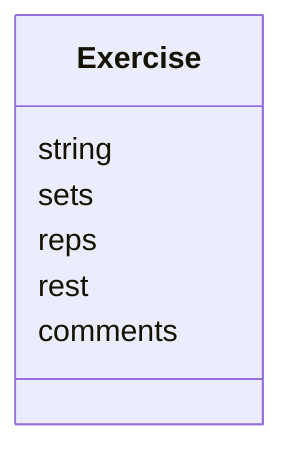
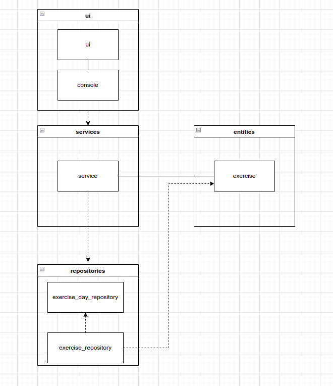
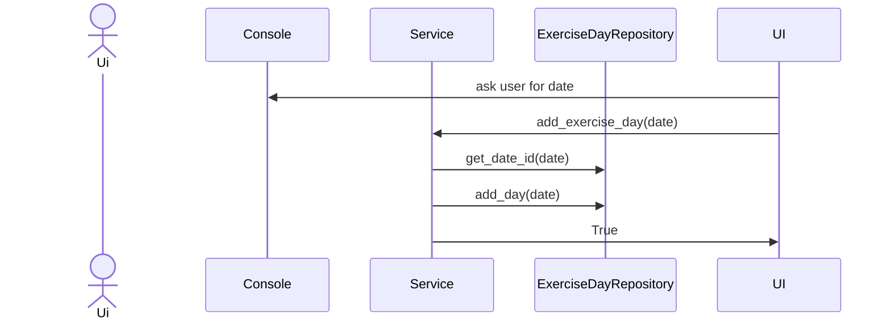
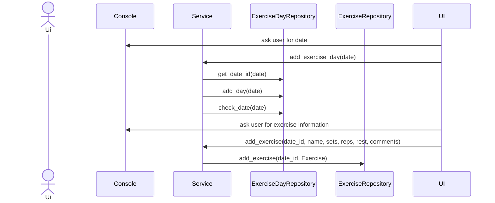

# Arkkitehtuurikuvaus

## Rakenne

Koodin pakkausrakenne on seuraava:

Pakkaus _ui_ sisältää käyttöliittymästä, _services_ sovelluslogiikasta ja _repositories_ tietojen pysyväistallennuksesta vastaavan koodin. Pakkaus _entities_ sisältää luokkia, jotka kuvastavat sovelluksen käyttämiä tietokohteita.

## Käyttöliittymä

Käyttöliittymä on toteutettu tekstikäyttöliittymänä, josta vastaavat luokat ui ja console.

Tekstikäyttöliittymän valikon näyttämisestä ja sen käyttämisestä vastaa [UI](https://github.com/JoJoensuu/ot-harjoitustyo/blob/master/python-strenght-training-app/src/ui/ui.py)-luokka. Käyttäjän syöttämän tekstin välittämisestä vastaa [Console](https://github.com/JoJoensuu/ot-harjoitustyo/blob/master/python-strenght-training-app/src/ui/console.py)-luokka. Käyttöliittymä on pyritetty eristämään täysin sovelluslogiikasta. Se kutsuu [Service](https://github.com/JoJoensuu/ot-harjoitustyo/blob/master/python-strenght-training-app/src/services/service.py)-luokan metodeja.

## Sovelluslogiikka

Sovelluksen loogisen tietomallin muodostaa luokka  [Exercise](https://github.com/JoJoensuu/ot-harjoitustyo/blob/master/python-strenght-training-app/src/entities/exercise.py), joka kuvaa yhtä harjoitusta.

Toiminnallisista kokonaisuuksista vastaa luokkan [Service](https://github.com/JoJoensuu/ot-harjoitustyo/blob/master/python-strenght-training-app/src/services/service.py) ainoa olio. Luokka tarjoaa kaikille käyttäliittymän toiminnoille oman metodin.

_Service_ pääsee käsiksi harjoituksiin tietojen tallennuksesta vastaavan pakkauksessa _repositories_ sijaitsevien luokkien [ExerciseRepository](https://github.com/JoJoensuu/ot-harjoitustyo/blob/master/python-strenght-training-app/src/repositories/exercise_repository.py) ja [ExerciseDayRepository](https://github.com/JoJoensuu/ot-harjoitustyo/blob/master/python-strenght-training-app/src/repositories/exercise_day_repository.py) kautta. Luokkien toteutuksen [injektoidaan](https://en.wikipedia.org/wiki/Dependency_injection) sovelluslogiikalle konstruktorikutsun yhteydessä.

`Service`-luokan ja ohjelman muiden osien suhdetta kuvaava luokka/pakkauskaavio:

## Tietojen pysyväistallennus

Pakkauksen _repositories_ luokat `ExerciseRepository` ja `ExerciseDayRepository` huolehtivat tietojen tallettamisesta. Molemmat tallentavat tietoa SQLite-tietokantaan.

Luokat noudattavat [Repository](https://en.wikipedia.org/wiki/Data_access_object) -suunnittelumallia ja ne on tarvittaessa mahdollista korvata uusilla toteutuksilla, jos sovelluksen datan talletustapaa päätetään vaihtaa.

### Tiedostot

Harjoitukset ja harjoituspäivät tallennetaan SQLite-tietokannan tauluihin `exercises` ja `exercise_days`, jotka alustetaan [initialize_database.py](https://github.com/JoJoensuu/ot-harjoitustyo/blob/master/python-strenght-training-app/src/initialize_database.py)-tiedostossa.

## Päätoiminnallisuudet

Kuvataan seuraavaksi sovelluksen toimintalogiikka muutaman päätoiminnallisuuden osalta sekvenssikaaviona.

### Harjoituspäivän lisääminen

Kun tekstikäyttöliittymän valikosta valitaan "1" etenee ohjelman toiminta seuraavasti:

### Uuden harjoituksen lisääminen

